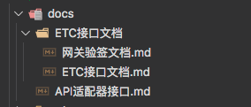
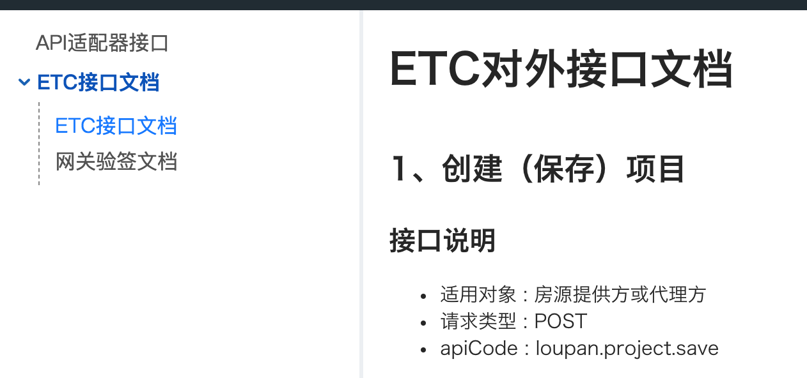

### 预览地址：
- 开发：<http://dev-open.ejuetc.com/>
- 测试：<http://test-open.ejuetc.com/>
- 生产：<http://open.ejuetc.com/>

### 仓库主要分支
- 为满足前端，后端使用当前仓库，避免合并冲突，使用者请按照如何规范使用提交代码
  
添加md文档分支
> docs/master

前端开发分支
> dev/x.x

### 添加md文档

分支切换到

> git checkout docs/master


将需要发布的md文档放入文件夹

- etc对外文档储存路径 `./src/docs/`
- etc对内（内部文档）档储存路径 `./src/inner-docs/`
- 开发文档储存路径 `./src/open-docs/`

#### 规则

线上网页菜单规则对应该文件夹下文件层级关系

例：

```txt
-- example/
----- example.md
----- v1.0.1/
-------- example.md
----- v1.0.2/
-------- example.md
-- API适配器接口.md
-- ETC接口文档/
----- 网关验签文档.md
----- 网关验签文档.md
```



编译后，在网页左侧呈现菜单为:

```txt
-- example/
----- example
----- v1.0.1/
-------- example
----- v1.0.2/
-------- example
-- API适配器接口
-- ETC接口文档/
----- 网关验签文档
----- 网关验签文档
```



最后，在添加完成后，将改动同步到线上分支
> git add .
> git commit -am 'update doc'
> git pull origin docs/master
> git push origin docs/master

合并推送完成后，到jenkins[http://jenkins.eju-inc.com/job/etc-test/job/etc_openplatform_test_build/]进行发布即可
