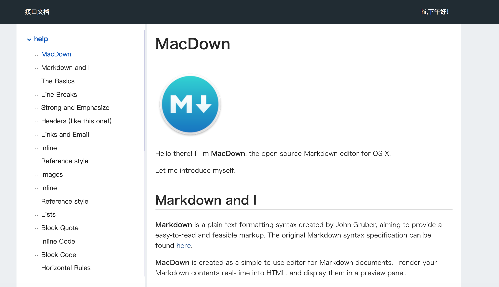
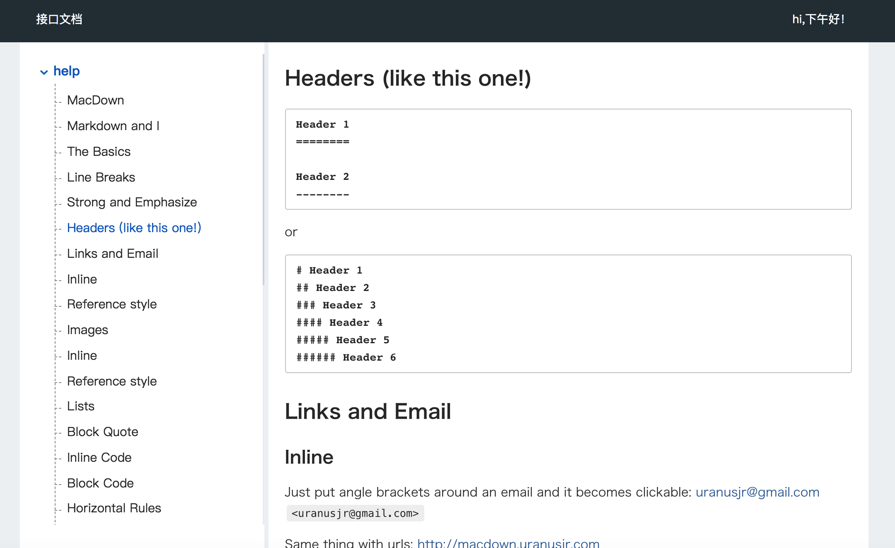

## 基于MackDown编写的文档，web文档

[点击此处在线预览](https://yunstv.github.io/markdown-doc-api/)





## 起源
由于公司业务需求，需要一个对外开开放的接口文档网页，便于后端同学使用，需要做到简洁明了，使用起来方便，最好直接可以一键入手

## 思路
提供给后端同学一个入口，只需要他们把文档markdown文件放到指定目录下，然后就能生成一个包含菜单，与md转成html预览块即可

## 使用

```
git clone https://github.com/yunstv/markdown-doc-api.git
```

```
yarn
``` 

本地环境
```
yarn start
``` 

生产环境包构建
```
yarn build
```

新增文档只需把md文件放入src/docs/ 目录后，
执行yarn start或yarn build即可

## 功能细节
基于指定目录下md文件
- 文档存在中文情况，中文路由路径在获取时存在些问题，这里做了处理，把中文字符做md5加密处理，通过md5转换后的字符进行路由配置
- 转化成浏览器能执行的html格式
- 便于用户查找，还需生成对应md目录
- 需要有包含指定目录下所以md文件大纲
- 由于定位目录名称存在重复情况，这里需要做导航id唯一性，需要在md转html时，增加处理

## 技术栈
开发环境，基于nodejs，使用到nodejs文件系统api，生产包构建基于webpack5.x，基于es6开发，使用babel转换，项目框架使用react17.x
